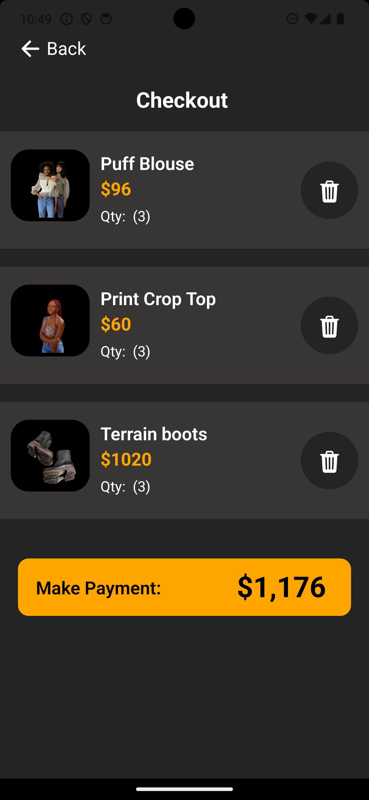

# Everyday Fashion App

This is a elegant shopping mobile application built using React Native (Expo), this app was conceived as a solution to HNG11 mobile track (Stage 2) task. The app provides a rich visual and shopping experience, the core features icluding, getting products from TimbuApi[https://timbu.cloud], displaying products, viewing product details and adding to cart, increasing item's quantity, removing item from cart, viewing items in cart (non-persist) and a simple checkout to success screen.

## Table of Contents

- [Features](#Features)
- [Screenshots](#screenshots)
- [Installations](#installations)
- [APK Download](#apk-download)
- [Contributing](#contributing)
- [License](#license)

## Features

1. Get products from Timbu API.
2. Add product to cart.
3. View product full details
4. Manage Cart (removing, adding, increasing/decreasing item quantity, getting total payable amount).
   . Successful order screen.

## Screenshots.




## Installations

To get started with this repository, follow these steps:

1. **Clone the repository:**

   ```bash
   git clone https://github.com/Dr-Oxy/everydayFashion.git
   ```

2. **Navigate to the project directory:**

   ```
   cd everydayFashion
   ```

3. **Set up development environment**
   To run android

   ```
   npm run android
   ```

   To run ios

   ```
   npm run ios
   ```

## APK Download

Download the latest app version of the app using the link below:

- [Download APK](https://expo.dev/artifacts/eas/akbivsSUFPWrpRTD5UE7aj.apk)

## Contributing

Contributions are encouraged and welcome. To contribute, please follow these steps:

1. **Fork the repository**
2. **Create a new branch**: `git checkout -b feature/your-feature-name`
3. **Make your changes**
4. **Commit your changes**: `git commit -m 'Add some feature'`
5. **Push to the branch**: `git push origin feature/your-feature-name`
6. **Create a pull request**

## License

This repository is licensed under the MIT License. For more details, please look at the [LICENSE](LICENSE) file.
